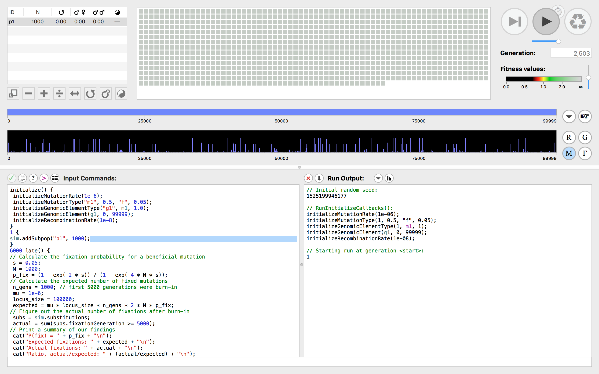

# SLiM 3.0 Tutorial

This tutorial (originally put together for UW's Fall 2018 `phyloseminar` and based partly on [a
blog post I wrote for *The Molecular Ecologist*](https://www.molecularecologist.com/2018/05/scriptable-evolutionary-simulations-in-slim-2/))
provides a very brief but hopefully illustrative example of how to run forward-time scriptable evolutionary
simulations in Haller and Messer's SLiM (**S**election on **Li**nked **M**utations) platform. We'll
look at 1) the basic model underpinning SLiM; 2) the basic features of the Eidos programming language;
and 3) very simple examples of the sort of questions you can answer in SLiM.  

## Introduction

Both empirical and theoretical population genetics are increasingly dependent on evolutionary simulations.
How did historical processes lead to the patterns of genetic variation observed in your data set? How do selection,
recombination, and drift interact to shape the genome during population divergence? These and many other questions that
require statistical model testing or that would be analytically intractable can benefit from the judicious application of
tools designed to model evolutionary processes *in silico*. As a result, our conclusions are increasingly dependent on the strength
of these tools, how we apply them, and the assumptions they make. Using programs that emphasize flexibility and reproducibility
give us the best shot at minimizing the potential pitfalls to this approach.     

SLiM 3 is a relatively new and unusually buzzed-about framework that achieves all of these goals.
Though SLiM 1.0 was launched 2013, its successor is less an update than what the developers refer to as
a ground-up rewrite. The primary feature that distinguishes it from its own ancestor and from most
(but not all; see [simuPOP](http://simupop.sourceforge.net/)) other simulators out there is its *scriptabilty*.
What this means is that you interact with SLiM through a novel, integrated programming language called `Eidos`. By design,
its syntax has strong similarities to `R` and `Python`, which most users will probably be familiar with.  

`Eidos`’ scriptability dramatically increases the breadth of cases evolutionary simulations can be useful for. Using `Eidos`,
you aren’t restricted to a set of arbitrary pre-existing scenarios (e.g. isolation with migration, or exponential population
growth after a bottleneck), and you can draw on powerful statements like for loops and conditionals. It requires a bit more
thought than entering values in a params files, sure. But you also don’t need to know `C++` or another high level
programming language.  

What’s underneath the hood? SLiM works in forward-time (as opposed to backwards-time, e.g. using coalescent theory),
simulating the the entire history of all individuals from the past to the present. Its base assumptions, which can be relaxed with sufficient effort, are more or less the Wright-Fisher model you’re familiar with: diploid individuals with nonoverlapping generations, whose probability of
parentage is proportional to fitness, and whose offspring are generated by recombinding parental chromosomes and
adding mutations. SLiM is genetically explicit in that it models mutations in distinct genetic regions. It does not,
however, easily model nucleotides themselves, or the probability they mutate into one another (though 4 allele states and backmutation
can be approximated) — so if that’s your goal, it may be better to look elsewhere. For most other applications, though, it’s hard to imagine a more powerful simulator.

## Installation

On Mac OS, download the SLiM 3.0 installer packager from [the official SLiM website](https://messerlab.org/slim/) and
run through the typical installation process. On other Unix platforms, download the source code instead, and follow
the instructions in the README file(s):

```
wget http://benhaller.com/slim/SLiM.zip
unzip SLiM.zip
```

Once you've done this, you'll have installed the command line tool, the SLiMgui RStudio-like environment,
and an `Eidos` scripting interface.  

## Running a simulation with the SLiMgui

A simple example from SLiM’s readable, extensive manual of how to test for Hill-Robertson interference
(the phenomenon of competing beneficial mutations reducing each other’s fixation probabilities below
theoretical expectations) does a nice job highlighting its strengths and getting us used to `Eidos`' syntax.

   

First, open up the SliM gui. You'll see a console on the bottom left, a window for simulation output, a button to run the simulation and set its speed, and a range of visualtions of individuals and mutations.  

In the console, we initialize a suite of basic simulation parameters, including a constant mutation rate (`1e-6`)
for mutation type "`m1`", which has a dominance coefficient of `0.5`, and a selection coefficient of `0.06` drawn from a fixed fitness effect distribution; a genomic element type to draw on the mutation type at a given frequency, a
specific genomic element (an exon) to hold that mutation, a fixed length (`1000000` sites), and fixed recombination rate (`1e-8`):

```
initialize() {
    initializeMutationRate(1e-6);
    initializeMutationType("m1", 0.5, "f", 0.05);
    initializeGenomicElementType("g1", m1, 1.0);
    initializeGenomicElement(g1, 0, 99999);
    initializeRecombinationRate(1e-8);
}
```

Next, we add a subpopulation ("`p1`") of size `1000`:

```
1 {
    sim.addSubpop("p1", 1000);
}
```

At generation `6000`, we’ve run the simulation for `5000` steps of burnin and an additional `1000` steps of our “real” experimental run:

```
6000 late() {
// Calculate the fixation probability for a beneficial mutation
     s = 0.05;
     N = 1000;
     p_fix = (1 - exp(-2 * s)) / (1 - exp(-4 * N * s));
// Calculate the expected number of fixed mutations
     n_gens = 1000; // first 5000 generations were burn-in
     mu = 1e-6;
     locus_size = 100000;
     expected = mu * locus_size * n_gens * 2 * N * p_fix;
// Figure out the actual number of fixations after burn-in
     subs = sim.substitutions;
     actual = sum(subs.fixationGeneration >= 5000);
```

We're also using `Eidos` to do some basic math, calculating: 1) the fixation probability (`p_fix`) of a beneficial mutation given our selection coefficient for `m1` and our population size; 2) the expected number of fixed mutations given our probability, our mutation rate, the length of our locus, and the number of generations the simulation has been running; and 3) sum the actual
number of fixed mutations following the burnin period.

```
// Print a summary of our findings
   cat("P(fix) = " + p_fix + "\n");
   cat("Expected fixations: " + expected + "\n");
   cat("Actual fixations: " + actual + "\n");
   cat("Ratio, actual/expected: " + (actual/expected) + "\n");
}
```

Finally, we print out our summary using the `cat()` command, and find beneficial mutations do appear to be interfering with each other.

## Running a simulation from the command line

While the SLiMgui is probably where you'll want to do most of your experimentation, "production"
length simulations are probably best initiated from the command line, as you'll likely want to
run multiple replicates with many generations via a cluster other high powered
computing resource. To demonstrate, let's simulate the response of selection to an influx of maladaptive alleles under different recipient population sizes.

We'll start by setting up our basic parameters: an overall mutation rate,
a neutral mutation with dominance coefficient of `0.5` and a fixed ("`f`") fitness effect with a selection coefficient of `0.0`, a nonneutral mutation with a dominance coefficient of `0.5` and an exponential ("`e`") distribution of fitness effects (beneficial in `p1` and deleterious in `p2`; we'll get to that); an exon from base `0` to base `99999` ("`g1`") to hold both mutations, with a relative frequency of `0.99` and `0.01` for neutral and nonneutral mutations, respectively; and a recombination rate:

```
initialize() {
	initializeMutationRate(1e-7);
	initializeMutationType("m1", 0.5, "f", 0.0); // neutral
	initializeMutationType("m2", 0.5, "e", 0.05); // - in p1, + in p2
	initializeGenomicElementType("g1", c(m1,m2), c(0.99,0.01));
	initializeGenomicElement(g1, 0, 99999);
	initializeRecombinationRate(1e-8);
}
```

We next set up a fitness "callback" to make the fitness effect of `m2` in `p1` the inverse (e.g. negative) of its impact in `p2`:

```
fitness(m2, p1) { return 1/relFitness; }
```
Then, we add two populations, `p1` and `p2`, of size `50` and `500`, respectively, and establish different migration rates in each direction. Note that these rates (`mig1` and `mig2`) are variables, not fixed; this will let us control their value
across replicate runs below:

```
1 {
	sim.addSubpop("p1", 50);
	sim.addSubpop("p2", 500);
	p1.setMigrationRates(c(p2),c(mig1));
	p2.setMigrationRates(c(p1),c(mig2));
}
```
After `10000` generations, we calculate the the mean nucleotide heterozygosity across the population, and write a `.txt` file with the output.

```
10000 { sim.simulationFinished(); }
10000 late() {
	// Calculate mean nucleotide heterozygosity across the population
	total = 0.0;
	for (ind in p1.individuals)
	{
		// Calculate the nucleotide heterozygosity of this individual
		muts0 = ind.genomes[0].mutations;
		muts1 = ind.genomes[1].mutations;
		// Count the shared mutations
		shared_count = sum(match(muts0, muts1) >= 0);
		// All remaining mutations are unshared (i.e. heterozygous)
		unshared_count = muts0.size() + muts1.size() - 2 * shared_count;
		// pi is the mean heterozygosity across the chromosome
		pi_ind = unshared_count / (sim.chromosome.lastPosition + 1);
		total = total + pi_ind;
	}
	pi = total / p1.individuals.size();
	line = paste(pi);
	cat("Mean nucleotide heterozygosity of p1 = " + pi + "\n");
	writeFile("~/Dropbox/nsf_prfb/output.txt", line, append=T);
}
```
I've set this up so that each replicate of the above simulation routine will be appended to `output.txt`, rather than overwriting it. To take advantage of this, we'll save the entire script above as `demo.txt`, and run it through the command line in a simple `bash` loop (`loop.sh`):

```
#!/bin/bash
for rep in {1..100}
do
	slim -d mig1=0 -d mig2=0.5 demo.txt
done
```

The command `slim` calls the program; `mig1` and `mig2` let you set the variables, and `demo.txt` is the script itself.

## Plotting

As an exercise, run the above script for different migration values and / or population sizes, and save the `output.txt` file with a unique name each time.
How is nucleotide diversity in the recipient population affected by different parameter values? The `R` script `plotting.R` provides a simple example of a way
to visualize these results.

## References

Haller, B.C., Messer, P.W. 2016. SLiM 2: flexible, interactive forward genetic simulations. Molecular Biology and Evolution, 34(1), pp.230-240. DOI: 10.1093/molbev/msw211

Hill, W.G., Robertson, A. 1966. The effect of linkage on limits to artificial selection. Genetics Research, 8(3), pp.269-294.

Messer, P.W. 2013. SLiM: simulating evolution with selection and linkage. Genetics, 194(4), pp.1037-1039. DOI: 10.1534/genetics.113.152181
